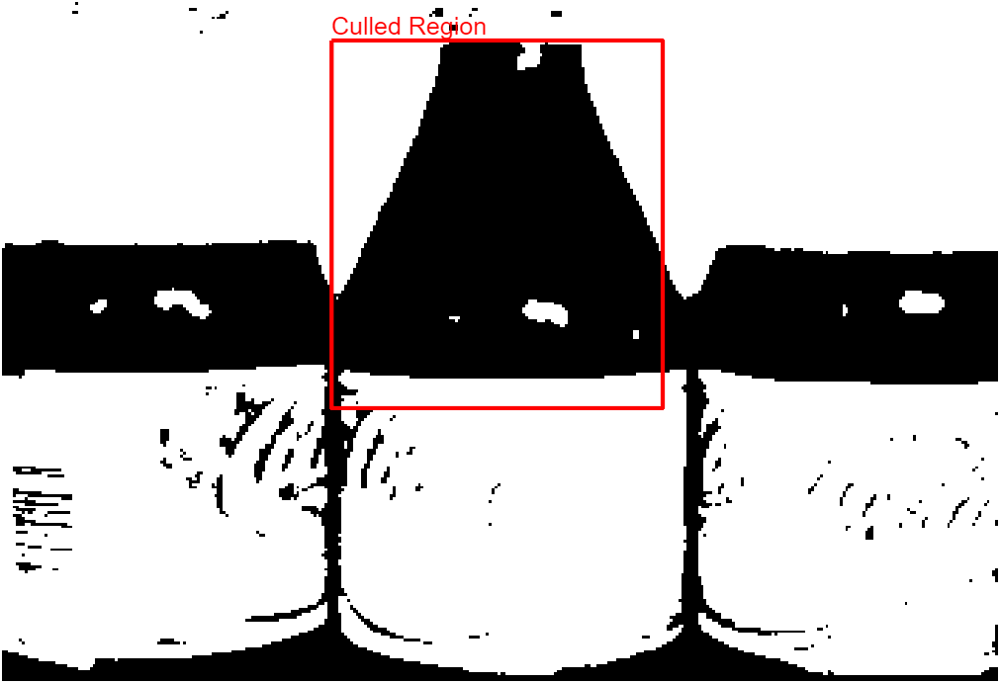
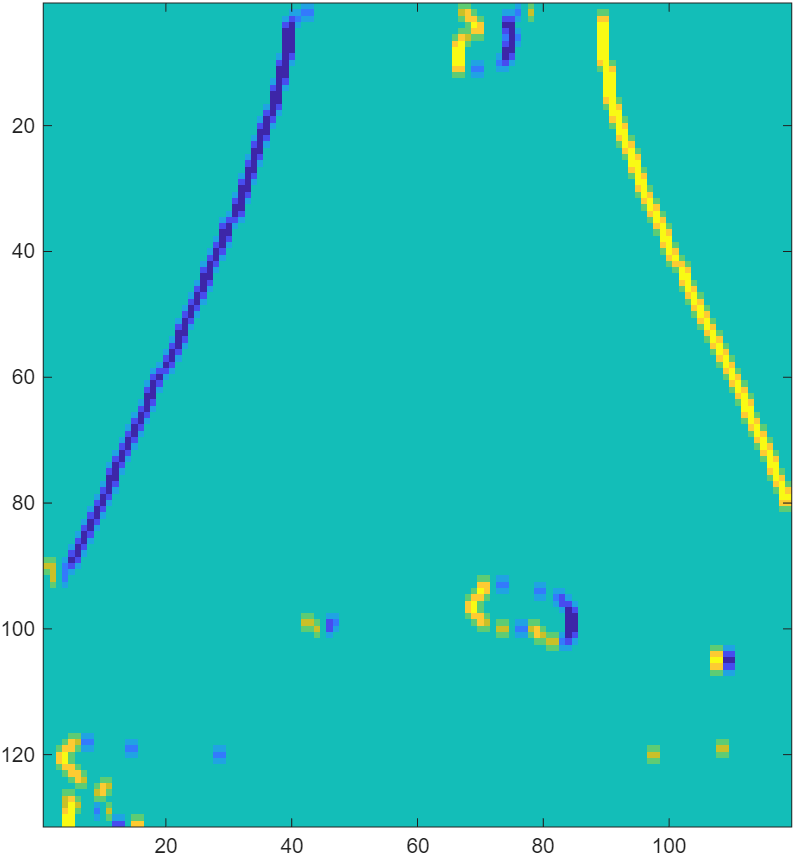
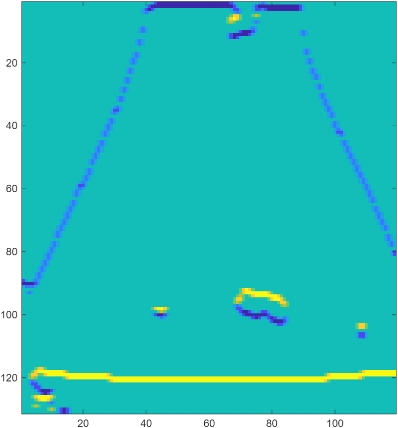
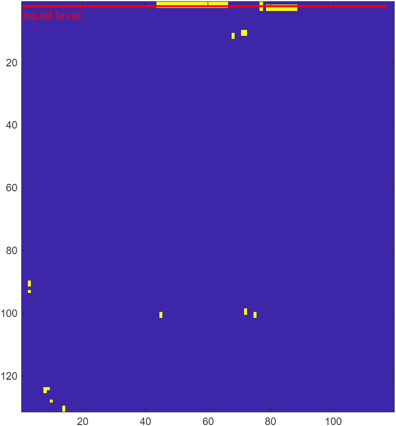
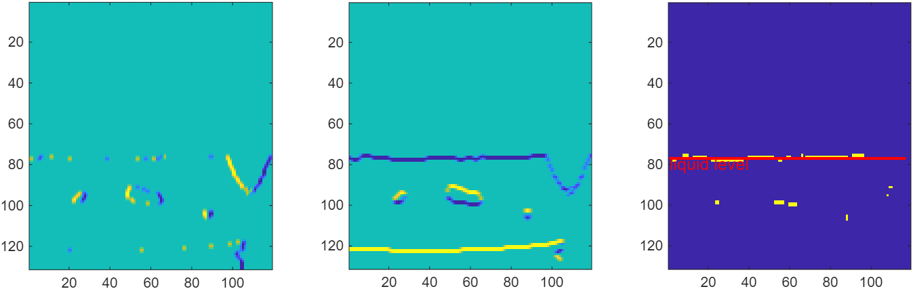
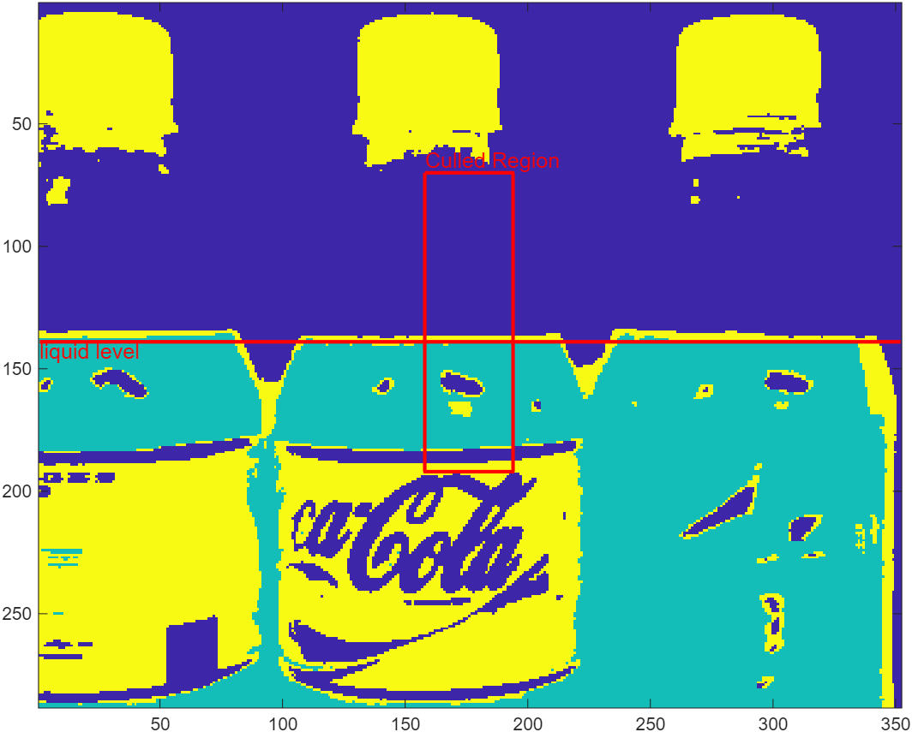
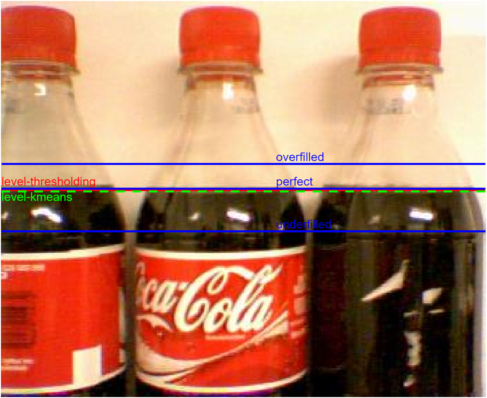

#### CS6640 A2

Haoyang Shi 

2025/09/12

#### 1. LLM queries

I did not consult LLM on this task.

#### 2. Technical basis

I detected the liquid level by thresholding and kmeans methods, and compared to the preset average levels for underfilled, perfect, and overfilled bottles. In pixel coordinates, those three levels are set to 168, 137, and 119, respectively. Those average levels are computed by running our liquid level detection once and labelling each image ("no bottle" defect excluded) with its liquid level, and then doing a kmeans clustering with 3 clusters. 

##### 2.1 Thresholding

The threshold for binarizing the image was set to 0.5922. This magic number is the Otsu threshold derived from the first image. I tried doing the Otsu algorithm on each image, but it turns out to fail on some empty bottle images because it uses a criteria that no longer distict the coke but detects the cap or the label, which leads to random liquid surface labeling. I was only keeping the binarized red channel where the red label and white background will be high illuminance, in contrast to low-illuminance coke.

After getting a binary image, I crop it to the region (62, 117) -(192, 234). This gives the central 1/3 region in width which is between the cap and the label in height. Then I computed gradient $g_x, g_y$ in x and y direction on the cropped, binarized image . 

I used the criterion `gx == 0 && gy < 0` to detect the horizontal upper boundary of the liquid-filled region. After this filtering, there was only the surface line and a few noise pixels left. For the final step, I took the median of the y-coordinate for the remaining pixels for the detected water level. For the corner case where there is not enough pixels (< 40) left, it is probably an empty bottle, and we set the liquid level to 255, which means very much underfilled.  

<!-- 

 -->

Left: gx. Middle: gy. Right: remaining pixels after filtering by gx == 0 and gy < 0. Liquid level is marked in red.

##### 2.2 K-means

I cropped the image first to the narrow central region as shown below where it's sure to be bottle. Then I ran kmeans with 3 clusters with (r,g,b) as 3d coordinates for each pixel in the cropped image. Then I find the coke cluster by selecting the group with the lowest average red value. Finally, I record the liquid level as the minimum y coordinate for pixels in the coke group.  

K-means clusters. Detection region is framed in red. Detected liquid level is mark by red horizontal line.

##### 2.3 Combining the two methods

After getting the liquid level in pixel coordinate from either method, I compute the distance to the average levels of underfilled, perfect, and overfilled, and used the distance ratio for confidence. For example, if the liquid level $y$ lies in range $[y_{\text{perfect}}, y_{\text{under}}]$, then the confidence $p = \frac{y - y_{\text{under}}}{y_{\text{under}} - y_{\text{perfect}}}$. The threshold was set to 0.5, as it would corespond the liquid level right in the middle of $y_{\text{under}}$ and $y_{\text{perfect}}$.

Red: liquid surface detected by thresholding method. Green: liquid surface detected by k-means. Blue lines from top to bottom marks the critiria for overfilled, perfect and underfilled. 

#### 3. Accuracy 

- Overfilled: 100% (for both methods)

- Underfilled: 100% (for both methods)

#### 4. New method for "no bottle" defect

I have not changed the "no bottle" defect function from A1, except for modifications to follow the specified programming style.